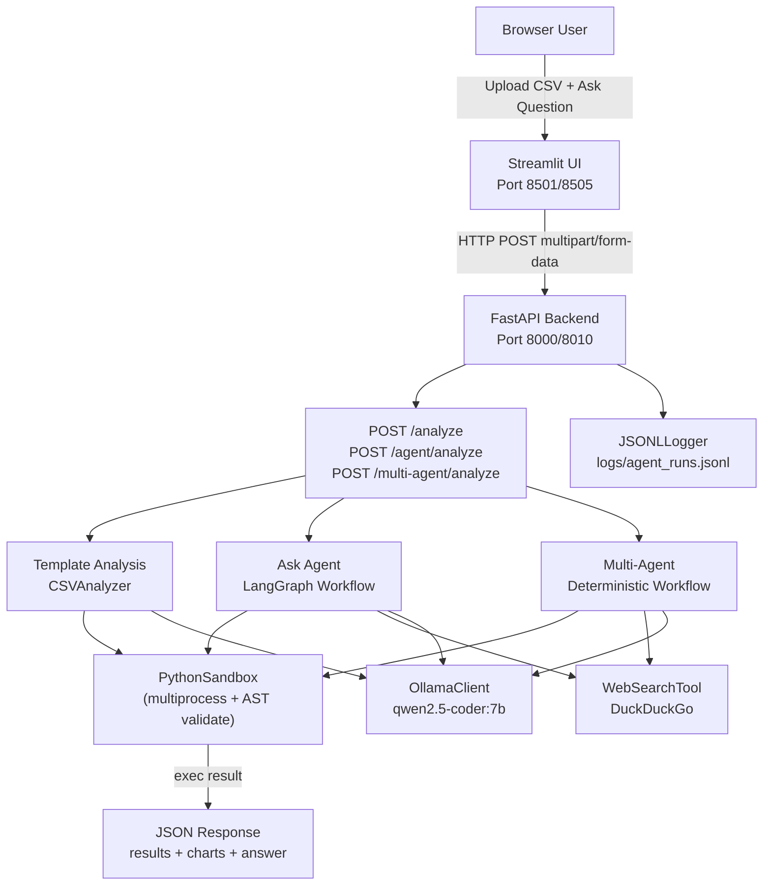
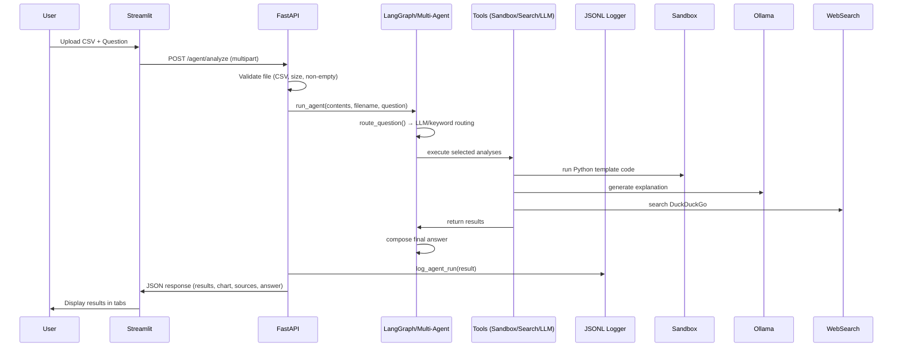
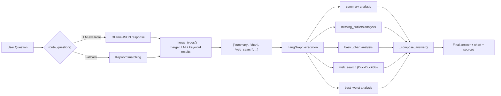
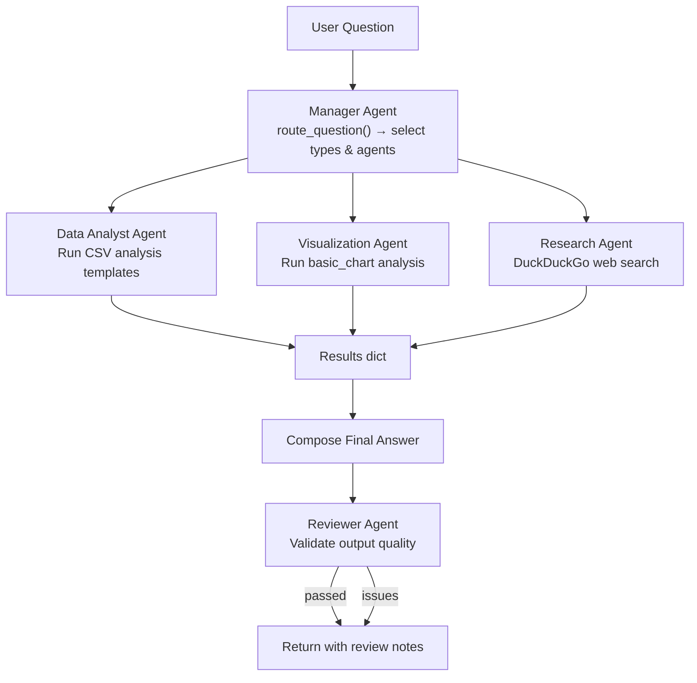
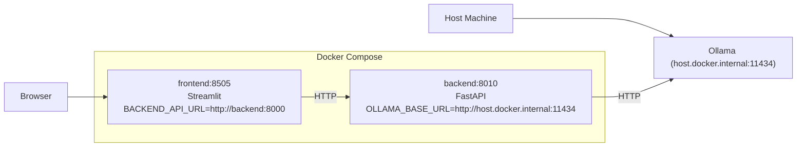

# Architecture

## High-Level System Architecture



## Component Responsibilities

| Component | File | Responsibility |
|---|---|---|
| **Streamlit Frontend** | `frontend/app.py` | CSV upload, 3-tab UI (Template/Agent/Multi-Agent), display results/charts/sources |
| **FastAPI Backend** | `backend/app/main.py` | 4 REST endpoints, CORS, global error handling, request routing |
| **CSVAnalyzer** | `backend/app/analysis/csv_analyzer.py` | Read CSV via pandas, select template, run sandboxed code, generate LLM explanation |
| **PythonSandbox** | `backend/app/executor/sandbox.py` | AST validation, import whitelist, blocked builtins, multiprocess isolation, timeout, output capping, result serialization |
| **LangGraph Agent** | `backend/app/agent/graph.py` | 3-node state graph: route → analyze → compose answer |
| **Multi-Agent** | `backend/app/agent/multi_agent.py` | 5 deterministic agents: Manager, Data Analyst, Visualization, Research, Reviewer |
| **Router** | `backend/app/agent/router.py` | Keyword matching + optional LLM routing to select analysis types |
| **WebSearchTool** | `backend/app/search/web_search.py` | DuckDuckGo search with retry fallbacks |
| **OllamaClient** | `backend/app/llm/ollama_client.py` | Ollama API wrapper with model fallback |
| **JSONLLogger** | `backend/app/logs/logger.py` | Append-only JSONL logging for all run modes |

## Endpoint Flow



## Agent Routing Flow



## Multi-Agent Workflow



## Docker Architecture



## Directory Structure

```
localdata/
├── backend/
│   ├── app/
│   │   ├── agent/          # LangGraph agent, multi-agent, router, state
│   │   ├── analysis/       # CSVAnalyzer, templates
│   │   ├── executor/       # PythonSandbox
│   │   ├── llm/            # OllamaClient
│   │   ├── logs/           # JSONLLogger
│   │   ├── models/         # Pydantic schemas
│   │   ├── search/         # WebSearchTool
│   │   ├── config.py       # Settings
│   │   └── main.py         # FastAPI app + routes
│   ├── tests/              # pytest test suite
│   └── requirements.txt
├── frontend/
│   ├── app.py              # Streamlit UI
│   └── requirements.txt
├── data/samples/           # Sample CSV datasets
├── logs/                   # JSONL log output
├── docker-compose.yml
├── Dockerfile              # backend
└── Dockerfile              # frontend (in frontend/ dir, referenced by compose)
```
